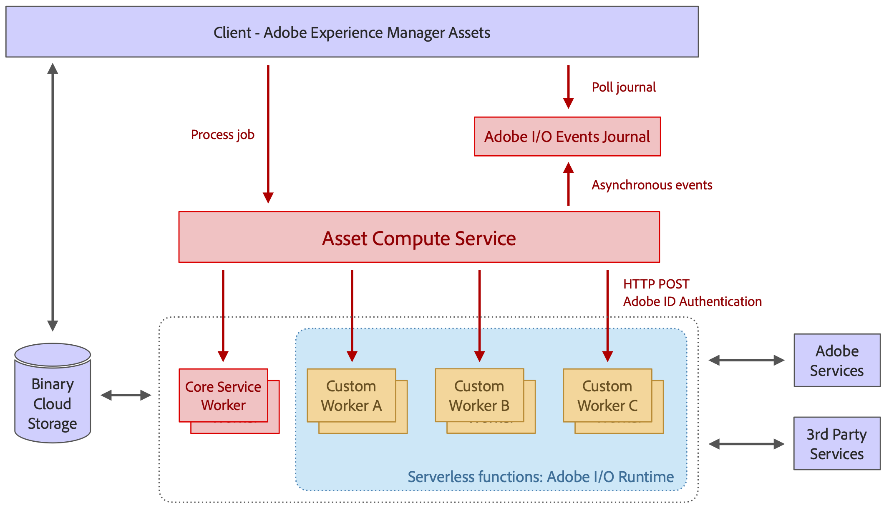

# Architettura di [!DNL Asset Compute Service] {#overview}

Il [!DNL Asset Compute Service] è basato su server senza server [!DNL Adobe I/O] piattaforma runtime. Fornisce il supporto di Adobe Sensei Content Services per le risorse. Il client chiamante (solo [!DNL Experience Manager] as a [!DNL Cloud Service] ) vengono fornite con le informazioni generate da Adobe Sensei che cercava per la risorsa. Le informazioni restituite sono in formato JSON.

[!DNL Asset Compute Service] è estendibile creando applicazioni personalizzate basate su [!DNL Project Adobe Developer App Builder]. Queste applicazioni personalizzate sono [!DNL Project Adobe Developer App Builder] app headless ed eseguono attività quali l’aggiunta di strumenti di conversione personalizzati o chiamate API esterne per eseguire operazioni sulle immagini.

[!DNL Project Adobe Developer App Builder] è un framework per la creazione e l’implementazione di applicazioni web personalizzate su [!DNL Adobe I/O] runtime. Per creare applicazioni personalizzate, gli sviluppatori possono sfruttare [!DNL React Spectrum] (Adobe UI toolkit), creare microservizi, eventi personalizzati e orchestrare API. Consulta [documentazione di Adobe Developer App Builder](https://developer.adobe.com/app-builder/docs/overview).

Le basi su cui si basa l’architettura includono:

* La modularità delle applicazioni, che contiene solo ciò che è necessario per una determinata attività, consente di separare le applicazioni l&#39;una dall&#39;altra e di mantenerle leggere.

* Il concetto di senza server [!DNL Adobe I/O] Runtime offre numerosi vantaggi: elaborazione asincrona, altamente scalabile, isolata e basata su processi, ideale per l’elaborazione delle risorse.

* L’archiviazione cloud binaria fornisce le funzioni necessarie per archiviare e accedere singolarmente ai file di risorse e alle rappresentazioni senza richiedere autorizzazioni di accesso completo all’archiviazione, utilizzando riferimenti URL prefirmati. Accelerazione del trasferimento, memorizzazione nella cache CDN e co-localizzazione delle applicazioni di elaborazione con l&#39;archiviazione cloud consentono un accesso ottimale ai contenuti a bassa latenza. Sono supportati sia i cloud AWS che Azure.

*Figura: Architettura di [!DNL Asset Compute Service] e come si integra con [!DNL Experience Manager], archiviazione ed elaborazione dell&#39;applicazione.*

L’architettura è costituita dalle seguenti parti:

* **Un livello di API e orchestrazione** riceve richieste (in formato JSON) che indicano al servizio di trasformare una risorsa di origine in più rappresentazioni. Le richieste sono asincrone e vengono restituite con un ID di attivazione, ovvero un ID processo. Le istruzioni sono puramente dichiarative e per tutto il lavoro di elaborazione standard (ad esempio generazione di miniature, estrazione di testo) i consumatori specificano solo il risultato desiderato, ma non le applicazioni che gestiscono determinate rappresentazioni. Le funzioni API generiche come l’autenticazione, l’analisi e la limitazione della velocità vengono gestite utilizzando il gateway API Adobe davanti al servizio e tutte le richieste indirizzate a [!DNL Adobe I/O] Runtime. Il routing dell’applicazione viene eseguito dinamicamente dal livello di orchestrazione. I client possono specificare un&#39;applicazione personalizzata per rappresentazioni specifiche e includere parametri personalizzati. L’esecuzione dell’applicazione può essere completamente parallela in quanto si tratta di funzioni separate senza server in [!DNL Adobe I/O] Runtime.

* **Applicazioni per l&#39;elaborazione delle risorse** che si specializzano in determinati tipi di formati di file o rappresentazioni di destinazione. Concettualmente, un’applicazione è simile al concetto di pipe Unix: un file di input viene trasformato in uno o più file di output.

* **A [libreria di applicazioni comune](https://github.com/adobe/asset-compute-sdk)** gestisce attività comuni come il download del file di origine, il caricamento delle rappresentazioni, la segnalazione di errori, l&#39;invio di eventi e il monitoraggio. Questo è progettato in modo che lo sviluppo di un’applicazione rimanga il più semplice possibile, seguendo l’idea senza server, e possa essere limitato alle interazioni con i file system locali.

<!-- TBD:

* About the YAML file?
* minimize description to custom applications
* remove all internal stuff (e.g. Photoshop application, API Gateway) from text and diagram
* update diagram to focus on 3rd party custom applications ONLY
* Explain important transactions/handshakes?
* Flow of assets/control? See the illustration on the Nui diagrams wiki.
* Illustrations. See the SVG shared by Alex.
* Exceptions? Limitations? Call-outs? Gotchas?
* Do we want to add what basic processing is not available currently, that is expected by existing AEM customers?
-->
